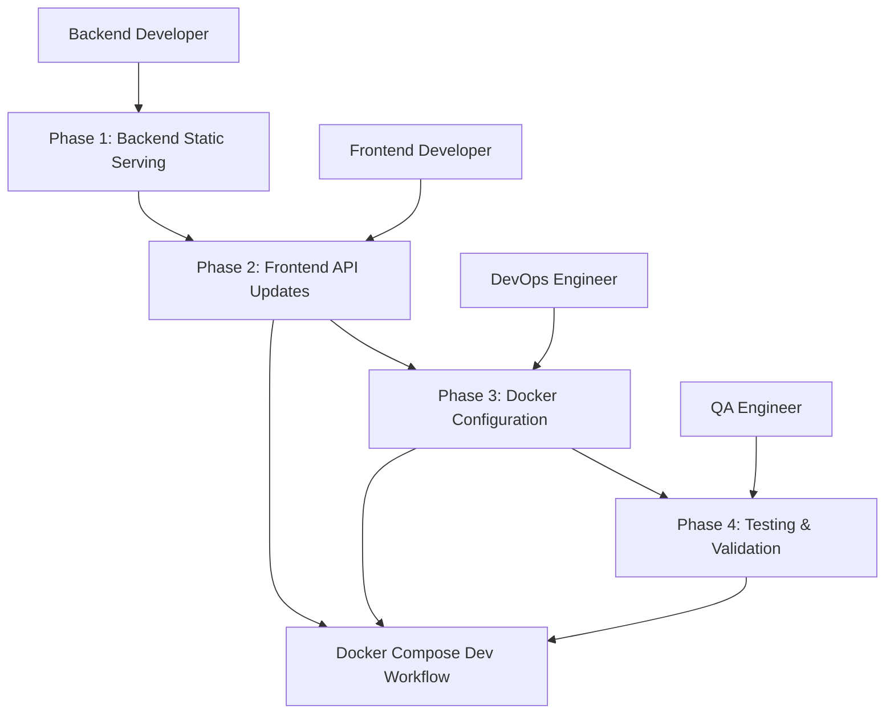

# Docker Consolidation - Multi-Agent Implementation Plan

## Overview

This document outlines the phased implementation strategy for consolidating the Momentum Rider backend and frontend into a single Docker container, while maintaining Docker Compose development workflow with live reload capabilities.

## Implementation Phases

### Phase 1: Backend Static File Serving (Agent: Backend Developer)

**Objective**: Modify the Express backend to serve static frontend files in production while maintaining API functionality.

**Tasks:**
1. **Update [`server/app.js`](server/app.js)** - Add static file serving middleware
2. **Configure CORS** - Update for same-origin requests in consolidated mode
3. **Add SPA routing** - Handle client-side routing fallback
4. **Test static serving** - Verify production build serves correctly

**Key Requirements:**
- Static files only served in `NODE_ENV=production`
- API routes remain functional
- SPA routing works for all non-API paths
- Development mode unaffected

**Docker Compose Preservation:**
- Backend continues to run independently in development
- Hot reload maintained for backend changes

### Phase 2: Frontend API Client Updates (Agent: Frontend Developer)

**Objective**: Update frontend API clients to work with relative paths in consolidated deployment.

**Tasks:**
1. **Update [`frontend/src/services/api-client.ts`](frontend/src/services/api-client.ts)** - Use `/api` relative paths
2. **Update [`frontend/src/services/http-client.ts`](frontend/src/services/http-client.ts)** - Configure for consolidated deployment
3. **Update [`frontend/src/stores/auth.ts`](frontend/src/stores/auth.ts)** - Ensure relative API paths
4. **Test API connectivity** - Verify both development and consolidated modes work

**Key Requirements:**
- API clients work with relative paths (`/api`)
- Environment variable fallback maintained
- Development mode continues to connect to backend on port 3001
- Production mode uses same-origin requests

**Docker Compose Preservation:**
- Frontend continues to connect to backend via Docker network in development
- Hot reload maintained for frontend changes

### Phase 3: Consolidated Docker Configuration (Agent: DevOps Engineer)

**Objective**: Create multi-stage Dockerfile and deployment configurations.

**Tasks:**
1. **Create root-level [`Dockerfile`](Dockerfile)** - Multi-stage build for both frontend and backend
2. **Create [`docker-compose.dev.yml`](docker-compose.dev.yml)** - Development with live reload
3. **Create [`docker-compose.pi.yml`](docker-compose.pi.yml)** - Production Raspberry Pi deployment
4. **Create [`.env.example`](.env.example)** - Consolidated environment variables
5. **Update [`README.md`](README.md)** - New deployment instructions

**Key Requirements:**
- Multi-stage build optimizes image size
- Development workflow preserved with live reload
- Production deployment works standalone
- Cross-platform compatibility (ARM64/x86_64)

**Docker Compose Preservation:**
- Development compose file maintains current workflow
- Volume mounts for live code changes
- Hot reload for both frontend and backend

### Phase 4: Testing and Validation (Agent: QA Engineer)

**Objective**: Verify consolidated deployment works across all scenarios.

**Tasks:**
1. **Build verification** - Test multi-stage Docker build
2. **Cross-platform testing** - Verify ARM64 and x86_64 compatibility
3. **Functionality testing** - Ensure all features work in consolidated mode
4. **Performance testing** - Compare resource usage
5. **Documentation** - Update testing procedures

**Key Requirements:**
- All existing functionality preserved
- Performance meets requirements
- Cross-platform deployment verified
- Development workflow unaffected

## Agent Assignments and Responsibilities

### Backend Developer Agent
- **Primary Focus**: Express static file serving implementation
- **Key Files**: [`server/app.js`](server/app.js), [`server/server.js`](server/server.js)
- **Deliverables**: 
  - Static file serving middleware
  - SPA routing fallback
  - CORS configuration updates
- **Coordination**: Work with Frontend Developer on API path changes

### Frontend Developer Agent
- **Primary Focus**: API client configuration for consolidated deployment
- **Key Files**: [`frontend/src/services/api-client.ts`](frontend/src/services/api-client.ts), [`frontend/src/services/http-client.ts`](frontend/src/services/http-client.ts)
- **Deliverables**:
  - Relative path API configuration
  - Environment variable handling
  - Cross-mode compatibility
- **Coordination**: Work with Backend Developer on API integration

### DevOps Engineer Agent
- **Primary Focus**: Docker configuration and deployment orchestration
- **Key Files**: [`Dockerfile`](Dockerfile), [`docker-compose.*.yml`](docker-compose.*.yml), [`.env.example`](.env.example)
- **Deliverables**:
  - Multi-stage Dockerfile
  - Development and production compose files
  - Environment configuration
- **Coordination**: Ensure all deployment scenarios work

### QA Engineer Agent
- **Primary Focus**: Testing and validation across all deployment scenarios
- **Key Activities**: Build testing, cross-platform verification, functionality testing
- **Deliverables**:
  - Test plans and results
  - Performance benchmarks
  - Deployment verification
- **Coordination**: Validate all agent deliverables

## Implementation Dependencies



## Docker Compose Development Workflow Preservation

### Current Development Workflow
```bash
# Current development
docker-compose up -d
# Frontend: http://localhost:3000 (hot reload)
# Backend: http://localhost:3001 (hot reload)
# Redis: localhost:6379
```

### Preserved Development Workflow
```bash
# New development (unchanged experience)
docker-compose -f docker-compose.dev.yml up -d
# Frontend: http://localhost:3000 (hot reload)
# Backend: http://localhost:3001 (hot reload) 
# Redis: localhost:6379
```

### New Consolidated Deployment Options
```bash
# Production standalone
docker build -t momentum-rider .
docker run -p 3000:3000 momentum-rider

# Production with Docker Compose
docker-compose -f docker-compose.pi.yml up -d
```

## Task Coordination and Handoff Points

### Handoff 1: Backend → Frontend
- **When**: Backend static serving implemented and tested
- **What**: API paths confirmed, CORS configured
- **Validation**: Backend serves static files correctly in production mode

### Handoff 2: Frontend → DevOps
- **When**: Frontend API clients updated and tested
- **What**: Relative paths working, environment variables configured
- **Validation**: Frontend works in both development and consolidated modes

### Handoff 3: DevOps → QA
- **When**: All Docker configurations complete
- **What**: Multi-stage build working, compose files functional
- **Validation**: All deployment scenarios build successfully

## Success Criteria

### Development Workflow
- [ ] `docker-compose -f docker-compose.dev.yml up -d` works exactly as before
- [ ] Frontend hot reload on code changes
- [ ] Backend hot reload on code changes
- [ ] Redis connectivity maintained

### Consolidated Deployment
- [ ] `docker build -t momentum-rider .` creates working image
- [ ] Single container serves both frontend and API
- [ ] All functionality preserved
- [ ] Cross-platform compatibility verified

### Performance
- [ ] Container startup time < 30 seconds
- [ ] Memory usage optimized for Raspberry Pi
- [ ] API response times maintained
- [ ] Static file serving efficient

## Risk Mitigation

### Development Workflow Risks
- **Risk**: Hot reload broken in consolidated development
- **Mitigation**: Maintain separate development compose file
- **Fallback**: Revert to current multi-container setup

### API Connectivity Risks
- **Risk**: Frontend cannot connect to backend in consolidated mode
- **Mitigation**: Thorough testing of relative path configuration
- **Fallback**: Environment variable override capability

### Build Process Risks
- **Risk**: Multi-stage Docker build fails
- **Mitigation**: Incremental build testing
- **Fallback**: Separate build scripts for frontend/backend

## Implementation Timeline

### Week 1: Foundation
- Backend static serving implementation
- Frontend API client updates
- Basic Docker configuration

### Week 2: Integration
- Multi-stage Dockerfile refinement
- Development workflow validation
- Initial testing

### Week 3: Validation
- Cross-platform testing
- Performance optimization
- Documentation updates

### Week 4: Deployment
- Production deployment testing
- Final validation
- Team handover

## Next Steps

1. **Assign agents** to respective phases
2. **Begin Phase 1** with Backend Developer agent
3. **Coordinate handoffs** between agents
4. **Maintain parallel development** workflow throughout implementation
5. **Validate each phase** before proceeding to next

This plan ensures the Docker consolidation is implemented systematically while preserving the critical Docker Compose development workflow that enables live changes during development.